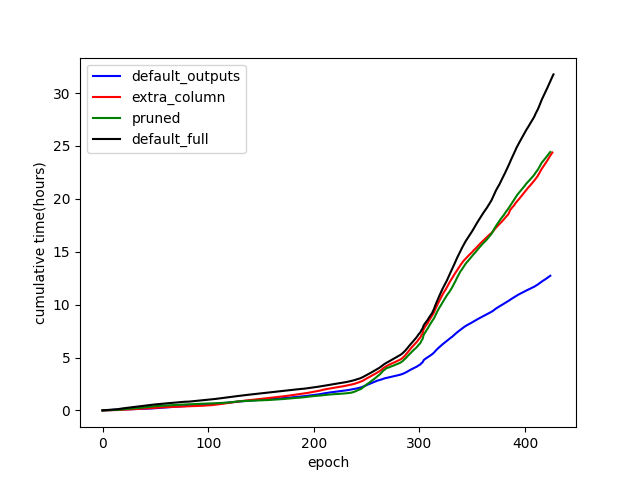
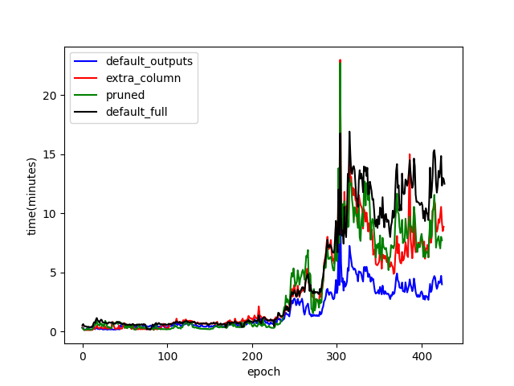
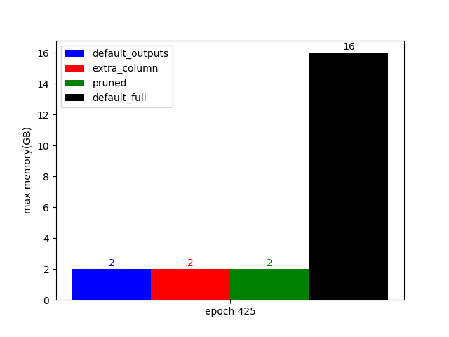
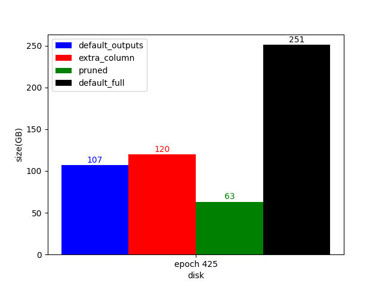
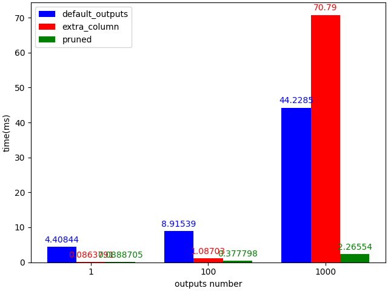
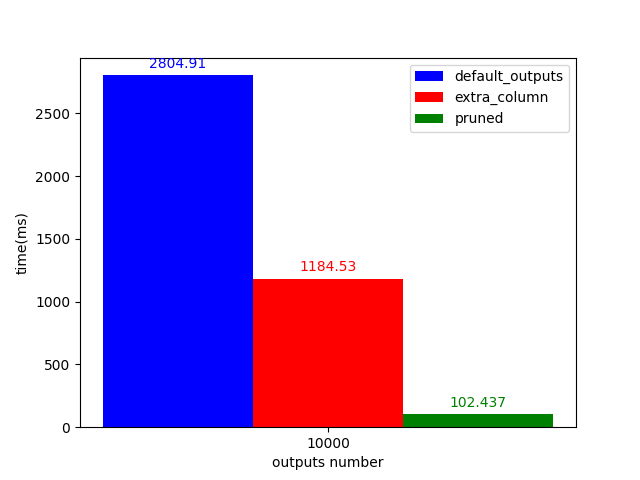

# DBSync flavours

Recently a big number of options and modulararity has been added to DBSync. The options either disable part of the data, making it faster to sync, or adjust part of the schema to make some queries faster. All options are orthogonal to each other, creating a big number of possible combinations. This blog introduces these options from a performance point of view and discusses their pros and cons.

We used DBSync in 4 flavors:
* default_full: is how DBSync runs without any of the options
* default_outputs: disables all data that can be disabled and leaves only blocks, txs, inputs, outputs, certificates
* extra_column: adds an extra column to the `tx_out` table when they are consumed by an input.
* pruned: same as above, but also periodically prunes the consumed outputs.

## Disabling data

It should be no surprise that by disabling some data, DBSync is much faster. default_outputs is 3 times faster than default DBSync. Disk size and max memory requirement are also much smaller. On the `state machine` and `future work` sections we will analyse why extra_column and pruned are relatively slow and how this will be improved.

## Output queries

The three colored options provide different speed in terms of querying UTxO by the address. The default behaviour requires a query to the outputs and then a query to the inputs to check if the output is unspent or not. The extra column makes the second query reduntant. The pruned option makes the output table way smaller, since less than 10% of outputs are unspent. Smaller table causes much faster queries.

**Note:** Some addresses have more than one UTxO. In these benchmarks we grouped the addresses based on this number and averaged the results per group. We plotted the results for 10000 UTxO per address on a different graph for better illustration reasons.

The difference is quite big. pruned provides up to 20-30x faster queries. Of course it cannot be used to query spent outputs, since they are pruned periodically. Something we need to investigate further is why extra column sometimes gives slower queries.

## State machine

In this section we explain the sync delayes caused by extra column and pruned, which motivate future work. This is the state machine for an output for the different options:

An output reaches the pruned state if the input that consumed it cannot be rollbacked, because there are over k=2160 blocks from it. The delays of the non-default options come from the `input consumes` transition, which translates to a DB update. DB updates are always slow and so far we have tried to avoid them in DBSync. 

## Future work

We believe there is a way to get the query performance of pruned without the syncing delay that its initial implementation shows. We can achieve it by delaying the insertion of the outputs until DBSync reaches the tip of the chain. By doing so we can bypass most of the state machine changes, that tranlate to expensive DB queries.

## Technical details about the benchmarks

The benchmarks were executed on a pc with CPU i7-12700K, Gen4 NVMe with enough space and memory. The queries and the plots were done by a pythong script that can be found https://github.com/input-output-hk/cardano-db-sync/blob/blog/blog/plots.py

## Conclusion

The main conlusion is that different options cover different needs. A DBSync client has a big number of [options](../doc/configuration.md) to choose. In particular
* default_outputs: runs 3x faster with minimal memory requirements (2GB)
* pruned: provides up to 20-30x faster queries with small disk space requirements, but it cannot give results for spent outputs
* Future work can make pruned: faster to sync than any other option provided here.
