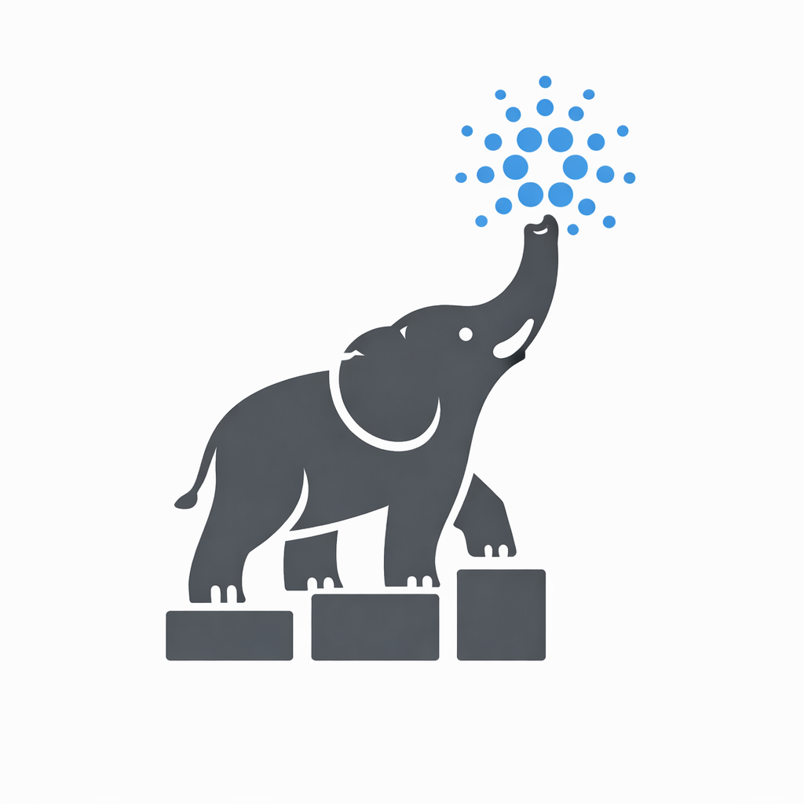

  

# Documentation Table of Contents

## Overview

This directory contains various documentation files for setting up, configuring, and running the Cardano DB Sync Node. Below is a list of available documents, ordered by their importance for users.

1. [Installing](https://github.com/IntersectMBO/cardano-db-sync/blob/master/doc/installing.md) - Detailed steps for installing the Cardano DB Sync from source without using Nix. This includes prerequisites, dependency installation, and building the project to ensure a smooth setup process.

2. [Installing with Nix](https://github.com/IntersectMBO/cardano-db-sync/blob/master/doc/installing-with-nix.md) - Comprehensive guide for installing Cardano DB Sync using Nix. It provides instructions on setting up the Nix environment, configuring Nix, and using it to manage the build and installation process.

3. [Building and Running](https://github.com/IntersectMBO/cardano-db-sync/blob/master/doc/building-running.md) - Instructions for setting up and running the Cardano DB Sync Node, including building the project using both Cabal and Nix, setting up the PostgreSQL database, and running the node with the appropriate configuration.

4. [Configuration](https://github.com/IntersectMBO/cardano-db-sync/blob/master/doc/configuration.md) - Details on how to configure the Cardano DB Sync Node, including configuration file settings, environment variables, and best practices for optimizing performance and reliability.

5. [Command Line Options](https://github.com/IntersectMBO/cardano-db-sync/blob/master/doc/command-line-options.md) - Complete documentation on command-line options for the Cardano DB Sync Node, including descriptions of each option, usage examples, and tips for effective command-line management.

6. [Running](https://github.com/IntersectMBO/cardano-db-sync/blob/master/doc/running.md) - Guide to running the Cardano DB Sync Node, covering the steps required to start the node, monitor its operation, and ensure it runs smoothly within different environments and configurations.

7. [Docker](https://github.com/IntersectMBO/cardano-db-sync/blob/master/doc/docker.md) - Instructions for using Docker to run the Cardano DB Sync Node, including setting up a Docker environment, creating Docker images, and running the node inside a Docker container for isolated and reproducible deployments.

8. [Upgrading PostgreSQL](https://github.com/IntersectMBO/cardano-db-sync/blob/master/doc/upgrading-postgresql.md) - Guide for upgrading PostgreSQL versions for use with Cardano DB Sync, including steps for backing up data, upgrading the PostgreSQL instance, and restoring the database to ensure compatibility and data integrity.

9. [Validation](https://github.com/IntersectMBO/cardano-db-sync/blob/master/doc/validation.md) - Information on the validation process for genesis, blocks, transactions, and runtime rewards, explaining how the node validates data to ensure integrity and consistency throughout the blockchain synchronization.

10. [Migrations](https://github.com/IntersectMBO/cardano-db-sync/blob/master/doc/migrations.md) - Details on database migrations for different versions of Cardano DB Sync, including instructions on applying migrations, handling schema changes, and ensuring data integrity during upgrades.

11. [Developer Database Encoders, Decoders, and DbInfo Instances](https://github.com/IntersectMBO/cardano-db-sync/blob/master/doc/database-encode-decode.md) - Comprehensive developer guide for implementing database schema components with Hasql, covering DbInfo instance configuration, entity and record encoders/decoders, bulk operation patterns, type mapping conventions, and field naming requirements to ensure type-safe database interactions and proper schema correspondence.

12. [Schema](https://github.com/IntersectMBO/cardano-db-sync/blob/master/doc/schema.md) - Overview of the database schema used by the Cardano DB Sync Node, providing a detailed description of the tables, relationships, and data types used in the database.

13. [Schema Management](https://github.com/IntersectMBO/cardano-db-sync/blob/master/doc/schema-management.md) - Instructions on managing the database schema and creating migrations, covering tools and techniques for making schema changes and ensuring they are applied correctly.

14. [Syncing and Rollbacks](https://github.com/IntersectMBO/cardano-db-sync/blob/master/doc/syncing-and-rollbacks.md) - Details on the syncing procedure and handling rollbacks, explaining how the node syncs with the blockchain and manages rollbacks in case of errors or inconsistencies.

15. [Community Tools](https://github.com/IntersectMBO/cardano-db-sync/blob/master/doc/community-tools.md) - Information on various community tools like Koios and Blockfrost, providing an overview of these tools, their features, and how they can be used to interact with Cardano DB Sync.

16. [Interesting Queries](https://github.com/IntersectMBO/cardano-db-sync/blob/master/doc/interesting-queries.md) - A collection of useful SQL queries for interacting with the database, including examples of queries for retrieving data, analyzing transactions, and generating reports.

17. [Troubleshooting](https://github.com/IntersectMBO/cardano-db-sync/blob/master/doc/troubleshooting.md) - Common issues and troubleshooting steps for Cardano DB Sync, providing solutions for various problems that users may encounter while running the node.

18. [Release Process](https://github.com/IntersectMBO/cardano-db-sync/blob/master/doc/release-process.md) - Detailed process for releasing new versions of Cardano DB Sync, covering the steps required to prepare, test, and publish a new release.

19. [State Snapshot](https://github.com/IntersectMBO/cardano-db-sync/blob/master/doc/state-snapshot.md) - Guide to creating and restoring state snapshots, explaining how to take snapshots of the database state and restore them when needed.

20. [Pool OffChain Data](https://github.com/IntersectMBO/cardano-db-sync/blob/master/doc/pool-offchain-data.md) - Handling off-chain data for staking pools, providing details on managing off-chain data and integrating it with the Cardano DB Sync Node.

21. [SMASH](https://github.com/IntersectMBO/cardano-db-sync/blob/master/doc/smash.md) - Information on the Stakepool Metadata Aggregation Server (SMASH), explaining the purpose of SMASH, how it works, and how to set it up.

22. [HLint and Stylish Haskell](https://github.com/IntersectMBO/cardano-db-sync/blob/master/doc/hlint-stylish-haskell.md) - Setting up `hlint` and `stylish-haskell` for code linting and formatting, providing instructions on configuring these tools to maintain code quality and consistency.
